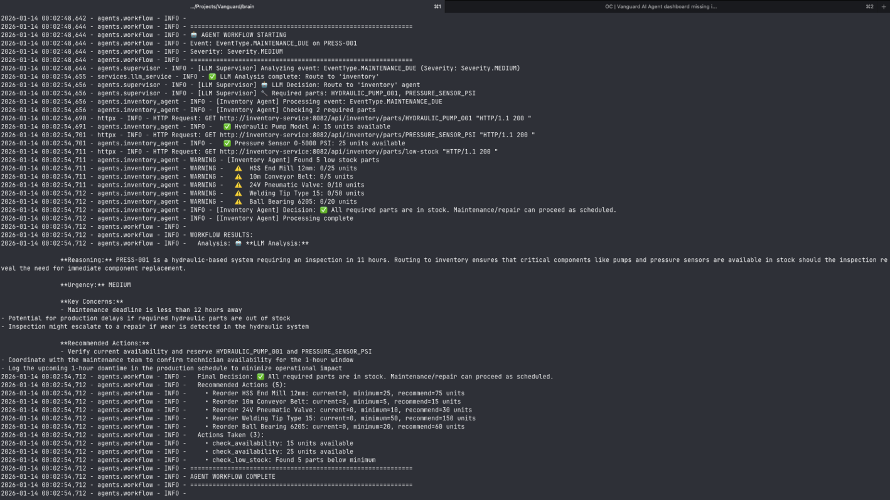
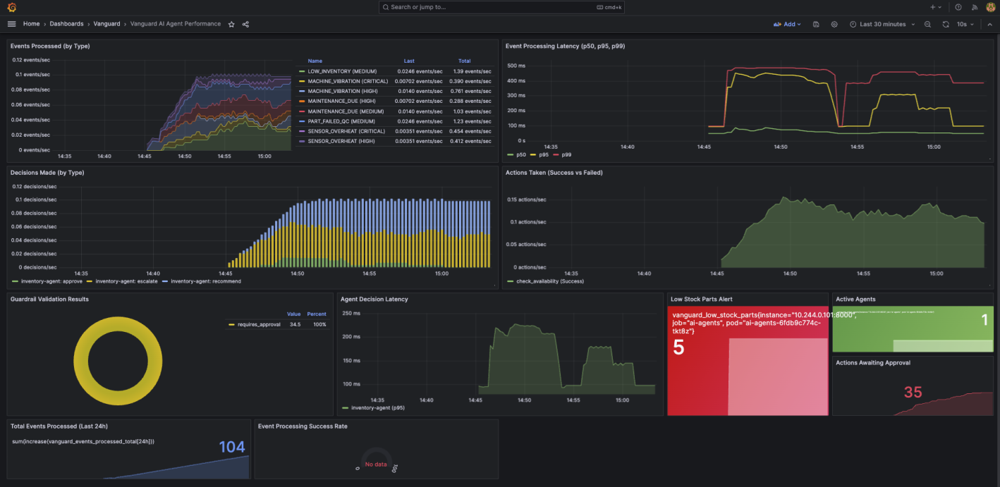

# Project Vanguard

> An autonomous, event-driven AI multi-agent system for industrial factory orchestration

<div align="center">

[](https://www.python.org/)
[](https://openjdk.org/)
[](https://langchain-ai.github.io/langgraph/)
[](https://kafka.apache.org/)
[](https://spring.io/projects/spring-boot)
[](https://kubernetes.io/)

[](https://opensource.org/licenses/MIT)
[]()
[]()

</div>

## Overview

**Vanguard** is a production-grade demonstration of how to safely integrate **LLM-powered AI agents** into critical industrial operations. The system combines Python-based AI orchestration (LangGraph) with high-performance Java microservices (Spring Boot) to autonomously manage factory operations through real-time event processing.

### What Makes This Different?

Unlike simple chatbot demos, Vanguard addresses real-world challenges of deploying AI in production:

- **Safety-First Design**: Multiple layers of guardrails prevent AI errors from causing real damage
- **Enterprise Integration**: Works with existing systems (Kafka, PostgreSQL, REST APIs)
- **Observable & Debuggable**: Full tracing of every AI decision with Prometheus/Grafana
- **Production-Ready Patterns**: Proper error handling, retries, circuit breakers, and audit logging
- **Scalable Architecture**: Kubernetes-native with horizontal pod autoscaling

### Use Cases

This architecture pattern is applicable to:

- 🏭 **Industrial Automation**: Predictive maintenance, inventory management, quality control
- 🏥 **Healthcare Operations**: Patient scheduling, resource allocation, supply chain
- 📦 **Logistics**: Route optimization, warehouse management, demand forecasting
- 💰 **Financial Services**: Fraud detection, compliance monitoring, trade execution
- 🛡️ **Security Operations**: Incident response, threat analysis, access control

### Key Features

| Feature                      | Description                                                         |
| ---------------------------- | ------------------------------------------------------------------- |
| 🧠 **LLM-Powered Reasoning** | Google Gemini analyzes events with natural language explanations    |
| 🛡️ **Safety Guardrails**     | Separate Java service enforces hard business rules AI cannot bypass |
| 📊 **Full Observability**    | Prometheus + Grafana with custom agent performance metrics          |
| ⚡ **Event-Driven**          | Apache Kafka (KRaft mode) for decoupled, async communication        |
| 🔄 **LangGraph Workflows**   | Declarative, stateful multi-agent orchestration                     |
| 👤 **Human-in-the-Loop**     | Critical operations require explicit human approval                 |
| 🔍 **Audit Trail**           | Every AI decision logged with full context for compliance           |
| 🚀 **Cloud-Native**          | Kubernetes deployment with auto-scaling and self-healing            |

### System Capabilities

| Category            | Traditional Approach                | Vanguard AI Agent Approach                     |
| ------------------- | ----------------------------------- | ---------------------------------------------- |
| **Event Analysis**  | Rule-based if/else logic            | LLM natural language reasoning                 |
| **Decision Making** | Static flowcharts                   | Dynamic routing based on event context         |
| **Adaptability**    | Requires code changes               | Learns from new event patterns                 |
| **Explainability**  | Opaque business rules               | Natural language explanations for every action |
| **Safety**          | Hard-coded limits (can be bypassed) | Multi-layer validation with human oversight    |
| **Scalability**     | Vertical scaling                    | Horizontal pod autoscaling                     |
| **Integration**     | Tightly coupled monolith            | Event-driven microservices                     |
| **Observability**   | Basic logs                          | Structured metrics, traces, and dashboards     |

## Architecture

```
┌────────────────────────────────────────────────────────────────────────────┐
│                              VANGUARD SYSTEM                                │
├────────────────────────────────────────────────────────────────────────────┤
│                                                                            │
│  ┌──────────────┐         ┌─────────────────────────────────────────────┐ │
│  │   Factory    │         │           AI Agent Brain (Python)           │ │
│  │  Simulator   │  Kafka  │  ┌─────────────────────────────────────────┐│ │
│  │   (Python)   │────────▶│  │           LangGraph Workflow            ││ │
│  │              │ Events  │  │                                         ││ │
│  │ • Overheat   │         │  │   ┌──────────┐    ┌──────────────────┐ ││ │
│  │ • Vibration  │         │  │   │Supervisor│───▶│ Inventory Agent  │ ││ │
│  │ • Low Stock  │         │  │   │  (LLM)   │    │                  │ ││ │
│  │ • Maint Due  │         │  │   └──────────┘    └────────┬─────────┘ ││ │
│  │ • QC Failure │         │  │                            │           ││ │
│  └──────────────┘         │  │                   ┌────────▼─────────┐ ││ │
│                           │  │                   │   Escalation     │ ││ │
│                           │  │                   │   (Human-in-Loop)│ ││ │
│                           │  │                   └──────────────────┘ ││ │
│                           │  └─────────────────────────────────────────┘│ │
│                           └───────────────────┬─────────────────────────┘ │
│                                               │                            │
│                          REST API Calls       │                            │
│                    ┌──────────────────────────┼──────────────────────┐    │
│                    │                          │                      │    │
│                    ▼                          ▼                      ▼    │
│  ┌─────────────────────────┐  ┌─────────────────────────┐  ┌───────────┐ │
│  │   Guardrail Service     │  │   Inventory Service     │  │ Postgres  │ │
│  │      (Java/Spring)      │  │     (Java/Spring)       │◀▶│    DB     │ │
│  │                         │  │                         │  │           │ │
│  │ • Max qty limits (50)   │  │ • Part CRUD             │  │ • Parts   │ │
│  │ • Critical part rules   │  │ • Stock transactions    │  │ • Txn Log │ │
│  │ • Rate limiting         │  │ • Availability checks   │  │ • Audit   │ │
│  │ • Audit logging         │  │                         │  └───────────┘ │
│  └─────────────────────────┘  └─────────────────────────┘                │
│                                                                            │
├────────────────────────────────────────────────────────────────────────────┤
│                          OBSERVABILITY LAYER                               │
│  ┌──────────────┐         ┌──────────────┐         ┌────────────────────┐ │
│  │  Prometheus  │────────▶│   Grafana    │         │  Structured Logs   │ │
│  │   Metrics    │         │  Dashboards  │         │   (JSON format)    │ │
│  └──────────────┘         └──────────────┘         └────────────────────┘ │
└────────────────────────────────────────────────────────────────────────────┘
```

## System Components

### AI Agent Brain (`brain/`)

The core decision-making engine built with **LangGraph** for declarative, stateful multi-agent workflows.

| Component              | Purpose                                                        |
| ---------------------- | -------------------------------------------------------------- |
| **Supervisor Agent**   | LLM-powered (Gemini) event analysis and routing decisions      |
| **Inventory Agent**    | Checks part availability, reserves stock, tracks low inventory |
| **Escalation Node**    | Handles critical events requiring human intervention           |
| **LangGraph Workflow** | Orchestrates agents with explicit graph structure              |

**Workflow Graph:**

```
START ──▶ Supervisor ──┬──▶ Inventory ──┬──▶ END
                       │                │
                       └──▶ END         └──▶ Escalation ──▶ END
```

### Factory Simulator (`simulator/`)

Generates realistic factory events for testing and demonstration:

| Event Type          | Description                                |
| ------------------- | ------------------------------------------ |
| `SENSOR_OVERHEAT`   | Temperature anomalies exceeding thresholds |
| `MACHINE_VIBRATION` | Abnormal equipment vibration patterns      |
| `LOW_INVENTORY`     | Stock levels below minimum quantity        |
| `MAINTENANCE_DUE`   | Scheduled maintenance approaching          |
| `PART_FAILED_QC`    | Quality control rejections                 |

### Guardrail Service (`services/guardrail-service/`)

**Java/Spring Boot** service that enforces safety constraints on all AI actions:

| Rule           | Limit          | Purpose                            |
| -------------- | -------------- | ---------------------------------- |
| Max Removal    | 50 units       | Prevent inventory depletion        |
| Max Addition   | 100 units      | Prevent data entry errors          |
| Critical Parts | Always approve | Protect safety-critical components |
| Rate Limit     | 10 ops/min     | Prevent runaway AI loops           |
| Reason Length  | ≥10 chars      | Ensure documentation               |

**Critical Parts** (require human approval): `HYDRAULIC_PUMP_001`, `SERVO_MOTOR_500W`, `PRESSURE_SENSOR_PSI`

### Inventory Service (`services/inventory-service/`)

**Java/Spring Boot** service as the source of truth for factory inventory:

- REST API for part management (CRUD operations)
- PostgreSQL persistence with transaction logging
- Availability checks and stock level queries

### Maintenance Service (`services/maintenance-service/`)

**Java/Spring Boot** service for maintenance event processing:

- Kafka event consumer
- Maintenance log tracking

---

## LLM Analysis Example

Here's how the Supervisor Agent (powered by Google Gemini) analyzes factory events:

**Input Event:**

```json
{
  "event_id": "evt_20260118_001234",
  "event_type": "SENSOR_OVERHEAT",
  "machine_id": "ASSEMBLY-LINE-2",
  "severity": "CRITICAL",
  "timestamp": "2026-01-18T14:23:45Z",
  "description": "Temperature sensor reading 111°C exceeds threshold of 80°C",
  "metadata": {
    "temperature_celsius": 111,
    "threshold_celsius": 80,
    "sensor_id": "TEMP-05",
    "location": "motor_housing",
    "trend": "rising"
  }
}
```

**LLM Analysis Output:**

```
━━━━━━━━━━━━━━━━━━━━━━━━━━━━━━━━━━━━━━━━━━━━━━━━━━━━━━━━━━━━━
🤖 SUPERVISOR AGENT ANALYSIS
━━━━━━━━━━━━━━━━━━━━━━━━━━━━━━━━━━━━━━━━━━━━━━━━━━━━━━━━━━━━━

📋 Event Summary:
   • Type: SENSOR_OVERHEAT (CRITICAL)
   • Machine: ASSEMBLY-LINE-2
   • Sensor: TEMP-05 at motor_housing

🔍 Reasoning:
   The temperature sensor TEMP-05 has exceeded its critical threshold
   by 31°C (111°C vs 80°C threshold), indicating high risk of equipment
   damage or fire. The "rising" trend suggests the issue is getting worse.

⚠️  Key Concerns:
   1. Immediate fire hazard and safety risk to personnel
   2. Potential for permanent damage to assembly line motors
   3. Production downtime on ASSEMBLY-LINE-2
   4. Risk of thermal damage to adjacent components

✅ Recommended Actions:
   1. IMMEDIATE: Emergency stop on ASSEMBLY-LINE-2
   2. Safety team dispatch for manual thermal inspection
   3. Check coolant system and motor bearings
   4. Source replacement parts (bearings, sensors, possibly motor)

🔀 Routing Decision: inventory
   Need to check availability of:
   - Replacement temperature sensor (TEMP-05-SERIES)
   - Motor bearings (preventive replacement)
   - Thermal paste for reassembly

━━━━━━━━━━━━━━━━━━━━━━━━━━━━━━━━━━━━━━━━━━━━━━━━━━━━━━━━━━━━━
```

**Inventory Agent Response:**

```
━━━━━━━━━━━━━━━━━━━━━━━━━━━━━━━━━━━━━━━━━━━━━━━━━━━━━━━━━━━━━
🔧 INVENTORY AGENT EXECUTION
━━━━━━━━━━━━━━━━━━━━━━━━━━━━━━━━━━━━━━━━━━━━━━━━━━━━━━━━━━━━━

🔍 Checking Parts Availability:

   ✅ TEMP_SENSOR_TYPE_K - In Stock
      • Available: 12 units
      • Required: 1 unit
      • Location: WAREHOUSE-A-SHELF-8

   ✅ MOTOR_BEARING_6205 - In Stock
      • Available: 8 units
      • Required: 2 units
      • Location: WAREHOUSE-B-SHELF-3

   ⚠️  THERMAL_PASTE_100G - Low Stock
      • Available: 3 units (minimum: 5)
      • Recommend reorder: 10 units

📝 Action Taken:
   • Reserved 1x TEMP_SENSOR_TYPE_K for repair
   • Reserved 2x MOTOR_BEARING_6205 for preventive maintenance
   • Created reorder request for THERMAL_PASTE_100G

✅ Final Decision: APPROVED
   All critical parts available. Maintenance can proceed immediately.

━━━━━━━━━━━━━━━━━━━━━━━━━━━━━━━━━━━━━━━━━━━━━━━━━━━━━━━━━━━━━
```

**Result**: The workflow automatically:

1. ✅ Identified the critical safety issue
2. ✅ Routed to inventory agent for parts check
3. ✅ Reserved necessary parts from warehouse
4. ✅ Flagged low-stock item for reorder
5. ✅ Enabled immediate maintenance action

**Execution Time**: ~3.2 seconds end-to-end

## Safety Flow

The system implements **defense in depth** to prevent AI errors:

```
┌─────────────────────────────────────────────────────────────┐
│                    Inventory Agent                          │
│  "Remove 10 units of HYDRAULIC_PUMP_001 for repair"        │
└─────────────────────────────┬───────────────────────────────┘
                              │
                              ▼
┌─────────────────────────────────────────────────────────────┐
│                    Guardrail Service                        │
│  1. Check quantity <= 50                        ✅ PASS     │
│  2. Check if critical part → HYDRAULIC_PUMP    ⚠️  FLAG    │
│  3. Check reason length >= 10                   ✅ PASS     │
│  4. Check rate limit                            ✅ PASS     │
│                                                             │
│  Result: REQUIRES_HUMAN_APPROVAL (202)                      │
└─────────────────────────────┬───────────────────────────────┘
                              │
                              ▼
┌─────────────────────────────────────────────────────────────┐
│                    Inventory Agent                          │
│  • Sets human_approval_needed = True                        │
│  • Does NOT execute action                                  │
│  • Logs: "Action pending human approval"                    │
└─────────────────────────────────────────────────────────────┘
```

---

## Observability

### Prometheus Metrics

| Category                 | Metrics                                                              |
| ------------------------ | -------------------------------------------------------------------- |
| **Agent Performance**    | `vanguard_events_processed_total`, `vanguard_agent_decision_seconds` |
| **Guardrail Validation** | `vanguard_guardrail_validations_total{result=approved\|rejected}`    |
| **Inventory Status**     | `vanguard_low_stock_parts`, `vanguard_parts_awaiting_approval`       |
| **System Health**        | JVM memory, HTTP latencies, Kafka consumer lag                       |

### Grafana Dashboards

1. **AI Agent Performance** - Event processing latency, decision success rates
2. **Inventory Service Health** - HTTP traffic, memory, uptime
3. **Guardrail Validation** - Approval/rejection rates, audit logs

---

## Screenshots

### 1. LLM Agent Workflow Logs


_Supervisor Agent's reasoning process and specialized agent handoffs._

### 2. AI Agent Performance Dashboard


_Real-time tracking of agent decisions, event processing latency, and action success rates._

---

## Technology Stack

| Layer                | Technology               | Purpose                           |
| -------------------- | ------------------------ | --------------------------------- |
| **AI Orchestration** | Python 3.12, LangGraph   | Declarative multi-agent workflows |
| **LLM**              | Google Gemini            | Event analysis and reasoning      |
| **Event Streaming**  | Apache Kafka (KRaft)     | Decoupled async communication     |
| **Backend Services** | Java 21, Spring Boot 3.4 | Enterprise-grade microservices    |
| **Database**         | PostgreSQL 16            | Inventory state and audit trails  |
| **API Gateway**      | FastAPI                  | REST/WebSocket workflow access    |
| **Observability**    | Prometheus + Grafana     | Metrics and dashboards            |
| **Deployment**       | Docker, Kubernetes       | Container orchestration           |

---

## Project Structure

```
vanguard/
├── brain/                      # AI Agent System (Python)
│   ├── agents/                 # LangGraph workflow + agents
│   │   ├── workflow_langgraph.py   # Main graph definition
│   │   ├── supervisor.py           # LLM-powered supervisor
│   │   ├── inventory_agent.py      # Inventory operations
│   │   ├── graph_nodes.py          # Node functions
│   │   ├── graph_routing.py        # Conditional routing
│   │   └── state.py                # AgentState TypedDict
│   ├── services/               # External service clients
│   │   └── llm_service.py          # Gemini API wrapper
│   ├── tools/                  # Agent tools
│   │   ├── inventory_tools.py      # Inventory API client
│   │   └── guardrail_client.py     # Guardrail API client
│   ├── metrics/                # Prometheus metrics
│   ├── api/                    # FastAPI gateway
│   └── consumer.py             # Kafka consumer entry point
│
├── services/                   # Java Microservices
│   ├── inventory-service/      # Part CRUD + transactions
│   ├── guardrail-service/      # Safety validation rules
│   └── maintenance-service/    # Maintenance logging
│
├── simulator/                  # Factory event generator
│
├── infrastructure/
│   ├── kubernetes/             # K8s manifests
│   │   └── monitoring/         # Prometheus + Grafana
│   ├── docker/                 # Docker Compose
│   └── scripts/                # Deployment automation
│
├── docs/                       # Documentation
│   ├── agent-architecture.md
│   ├── langgraph-integration.md
│   ├── phase4-safety-architecture.md
│   ├── api-documentation.md
│   ├── api-examples.md
│   ├── deployment-guide.md
│   ├── testing-strategy.md
│   └── phase2-learnings.md
│
└── docker-compose.yml          # Local development setup
```

---

## Quick Start

### Prerequisites

- **Docker Desktop** (v20.10+) with at least 8GB RAM allocated
- **Python 3.12+** with Poetry (`pip install poetry`)
- **Java 21+** with Maven (`brew install openjdk@21 maven`)
- **kubectl** and **minikube** (for Kubernetes deployment)
- **Google Gemini API Key** - Get one at [https://ai.google.dev/](https://ai.google.dev/)

### Environment Setup

```bash
# Clone the repository
git clone https://github.com/yourusername/vanguard.git
cd vanguard

# Set up environment variables
export GEMINI_API_KEY="your-api-key-here"

# Optional: Configure Python environment
export PYTHONPATH="${PYTHONPATH}:$(pwd)/brain"
```

### Local Development (Docker Compose)

**Option 1: Full Stack with Docker Compose**

```bash
# Start all infrastructure and services
docker-compose up -d

# Wait for services to be healthy (~30 seconds)
docker-compose ps

# View logs
docker-compose logs -f brain

# Access services:
# - Inventory API: http://localhost:8082/swagger-ui.html
# - Guardrail API: http://localhost:8083/swagger-ui.html
# - Prometheus: http://localhost:9090
# - Grafana: http://localhost:3000 (admin/admin)
```

**Option 2: Services in Docker, Agents in Local Python**

```bash
# Start infrastructure only (Kafka, Postgres, Java services)
docker-compose up -d kafka postgres inventory-service guardrail-service

# Run AI agents locally for faster development
cd brain
poetry install
poetry run python consumer.py

# In another terminal, run the API gateway
poetry run python run_api.py

# In another terminal, start the simulator
cd ../simulator
poetry install
poetry run python main.py
```

### Kubernetes Deployment

```bash
# Start minikube cluster
minikube start --memory=8192 --cpus=4

# Build and deploy all services
./infrastructure/scripts/local-deploy.sh

# Wait for pods to be ready
kubectl get pods -n vanguard -w

# Forward ports for local access
kubectl port-forward -n vanguard svc/inventory-service 8082:8080
kubectl port-forward -n vanguard svc/grafana 3000:3000

# View logs
kubectl logs -n vanguard -l app=brain -f
```

### Verify Installation

```bash
# Check Kafka topics
docker exec -it vanguard-kafka-1 kafka-topics.sh --bootstrap-server localhost:9092 --list

# Test Inventory Service
curl http://localhost:8082/api/inventory/parts

# Test Guardrail Service
curl http://localhost:8083/api/guardrail/health

# Trigger a test event
curl -X POST http://localhost:8084/workflows/trigger \
  -H "Content-Type: application/json" \
  -d '{
    "event_type": "LOW_INVENTORY",
    "machine_id": "PRESS-01",
    "severity": "MEDIUM",
    "description": "Hydraulic pump stock is low"
  }'
```

### Stopping Services

```bash
# Docker Compose
docker-compose down -v  # -v removes volumes

# Kubernetes
kubectl delete namespace vanguard
minikube stop
```

## Development Workflow

### Adding New Event Types

1. Add event type to [simulator/events.py](simulator/events.py)
2. Update supervisor prompt to handle new event in [brain/agents/supervisor.py](brain/agents/supervisor.py)
3. Add specialized agent if needed in [brain/agents/](brain/agents/)
4. Update workflow graph in [brain/agents/workflow_langgraph.py](brain/agents/workflow_langgraph.py)
5. Add tests in [brain/tests/](brain/tests/)

### Adding New Safety Rules

1. Update validation logic in [services/guardrail-service/src/](services/guardrail-service/src/)
2. Add corresponding tests
3. Update documentation in [docs/phase4-safety-architecture.md](docs/phase4-safety-architecture.md)


## Performance Benchmarks

Typical performance on modest hardware (4 CPU, 8GB RAM):

| Metric                    | Value       |
| ------------------------- | ----------- |
| Event Processing Latency  | 800-1200ms  |
| Supervisor Decision Time  | 2-3 seconds |
| Kafka Throughput          | 1000 msg/s  |
| Inventory API Response    | <50ms       |
| Guardrail Validation Time | <10ms       |
