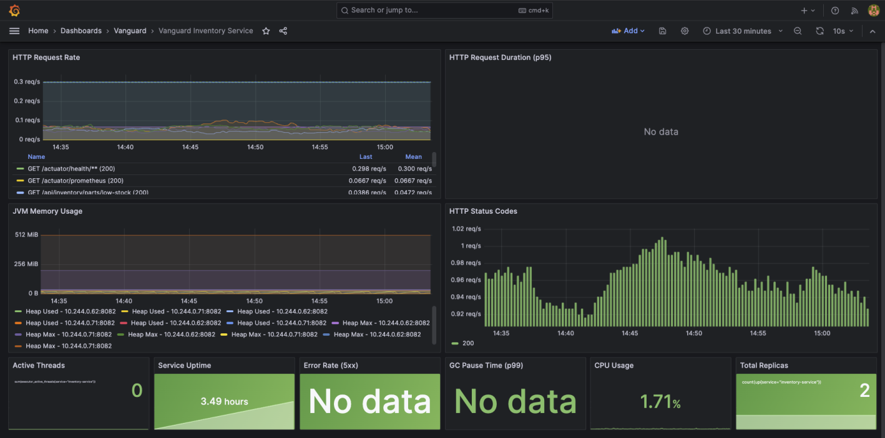

# Project Vanguard

> An autonomous, event-driven multi-agent system for industrial factory orchestration

[](https://www.python.org/)
[](https://openjdk.org/)
[](https://kubernetes.io/)
[](https://spring.io/projects/spring-boot)

## Overview

Vanguard is a production-grade system that combines **AI agents** (Python/LangGraph) with **high-performance microservices** (Java/Spring Boot) to autonomously manage factory operations through real-time event processing.

**Key Features:**
- **LLM-Powered Decision Making** - Google Gemini analyzes events and provides natural language explanations
- **Safety Guardrails** - Business logic constraints prevent AI errors
- **Full Observability** - Prometheus + Grafana monitoring with custom metrics
- **Event-Driven Architecture** - Apache Kafka for asynchronous communication
- **Multi-Agent System** - Specialized agents for inventory, maintenance, and scheduling


## Architecture
```
┌─────────────────┐         ┌──────────────────┐         ┌─────────────────┐
│  Factory        │         │   LLM Supervisor │         │   Guardrail     │
│  Simulator      │────────▶│   (Gemini AI)    │────────▶│   Service       │
│  (Python)       │  Kafka  │   + Agents       │   REST  │   (Safety)      │
└─────────────────┘         └──────────────────┘         └─────────────────┘
                                     │                             │
                                     ▼                             ▼
                            ┌─────────────────┐         ┌─────────────────┐
                            │   Inventory     │◄────────│   PostgreSQL    │
                            │   Service       │         │   Database      │
                            │   (Spring Boot) │         └─────────────────┘
                            └─────────────────┘
```

## 📊 System Components

### 1. Factory Simulator (Python)
Generates realistic factory events:
- `SENSOR_OVERHEAT` - Temperature anomalies
- `MACHINE_VIBRATION` - Equipment issues
- `LOW_INVENTORY` - Stock alerts
- `MAINTENANCE_DUE` - Scheduled maintenance
- `PART_FAILED_QC` - Quality control failures

**Location:** `simulator/`

### 2. LLM-Powered Supervisor Agent (Python + Gemini)
Analyzes events using Google Gemini and provides:
- Natural language reasoning
- Context-aware routing decisions
- Risk assessment
- Actionable recommendations

**Location:** `brain/agents/supervisor.py`

### 3. Inventory Agent (Python)
Manages spare parts inventory:
- Checks part availability
- Reserves parts for repairs
- Tracks low stock conditions
- Validates actions through guardrails

**Location:** `brain/agents/inventory_agent.py`

### 4. Guardrail Service (Java/Spring Boot)
Enforces safety constraints:
- Maximum removal quantities (50 units)
- Critical part protection
- Human-in-the-loop for high-risk actions
- Audit trail logging

**Location:** `services/guardrail-service/`

### 5. Inventory Service (Java/Spring Boot)
Source of truth for factory inventory:
- REST API for part management
- PostgreSQL persistence
- Transaction audit trail
- Kafka event consumption

**Location:** `services/inventory-service/`

### 6. Maintenance Service (Java/Spring Boot)
Processes maintenance events:
- Kafka event consumer
- Maintenance log tracking

**Location:** `services/maintenance-service/`

---

## 🤖 LLM Analysis Example

**Input Event:**
```json
{
  "event_type": "SENSOR_OVERHEAT",
  "machine_id": "ASSEMBLY-LINE-2",
  "severity": "CRITICAL",
  "description": "Temperature sensor reading 111°C exceeds threshold of 80°C",
  "metadata": {
    "temperature_celsius": 111,
    "sensor_id": "TEMP-05"
  }
}
```

**LLM Analysis Output:**
```
🤖 Reasoning: The temperature sensor TEMP-05 has exceeded its critical
threshold by 31°C, which indicates a high risk of equipment damage or fire.

⚠️ Key Concerns:
- Immediate fire hazard and safety risk to personnel
- Potential for permanent damage to assembly line hardware
- Production downtime on ASSEMBLY-LINE-2

✅ Recommended Actions:
- Trigger emergency stop on ASSEMBLY-LINE-2
- Dispatch technician for manual thermal inspection
- Source replacement sensor and check rotating components
```


## 📊 Observability

### Prometheus Metrics
- **System Metrics:** JVM memory, CPU, HTTP requests, latencies
- **Business Metrics:** Events processed, decisions made, stock levels
- **Custom Metrics:** Agent performance, guardrail validations

### Grafana Dashboards
1. **Inventory Service Dashboard** - HTTP traffic, memory, uptime
2. **AI Agent Performance** - Event processing, decision latency, success rates
3. **Guardrail Validation** - Approval/rejection rates, audit logs

**Access:** `kubectl port-forward -n vanguard svc/grafana-service 3000:3000`

## Screenshots

### 1. LLM Agent Workflow Logs

*Terminal output showcasing the Supervisor Agent's reasoning process and specialized agent handoffs.*

### 2. AI Agent Performance Dashboard

*Real-time tracking of agent decisions, event processing latency, and action success rates.*

### 2. Inventory Service Health

*Monitoring JVM metrics, HTTP request rates, and service uptime for the core inventory backend.*


## 🚀 Quick Start

### Prerequisites
- Docker Desktop
- Minikube or Kubernetes cluster
- Python 3.12+
- Java 21+
- kubectl

### One-Command Deployment
```bash
# Clone the repository
git clone https://github.com/yourusername/vanguard.git
cd vanguard

# Start Minikube
minikube start --memory=8192 --cpus=4

# Build and deploy
./infrastructure/scripts/local-deploy.sh
```

### Verify Deployment
```bash
# Check all pods are running
kubectl get pods -n vanguard

# View AI agent logs
kubectl logs -f deployment/ai-agents -n vanguard

# Access Grafana dashboards
kubectl port-forward -n vanguard svc/grafana-service 3000:3000
# Open http://localhost:3000 (admin/vanguard2024)
```

## Testing

### Unit Tests
```bash
# Python tests
cd brain
pytest tests/

# Java tests
cd services/inventory-service
mvn test
```

### Integration Tests
```bash
# Test repository layer with H2
cd services/inventory-service
mvn test -Dtest=PartRepositoryTest

# Test service layer with Mockito
mvn test -Dtest=InventoryServiceTest
```

---

## Technology Stack

### Backend Services
- **Java 21** - Modern language features (Records, Pattern Matching)
- **Spring Boot 3.4+** - Microservices framework
- **Spring Kafka** - Event streaming integration
- **Hibernate/JPA** - Database ORM
- **PostgreSQL** - Relational database

### AI & Agent System
- **Python 3.12** - Agent orchestration
- **LangGraph** - Multi-agent workflows
- **Google Gemini** - LLM for reasoning
- **Pydantic** - Data validation
- **httpx** - Async HTTP client

### Infrastructure
- **Apache Kafka (KRaft)** - Event streaming platform
- **Docker** - Containerization
- **Kubernetes** - Orchestration
- **Prometheus** - Metrics collection
- **Grafana** - Visualization


## 📁 Project Structure
```
vanguard/
├── brain/                    # AI Agent System (Python)
│   ├── agents/              # Supervisor + Inventory agents
│   ├── services/            # LLM service (Gemini)
│   ├── tools/               # Inventory + Guardrail clients
│   ├── metrics/             # Custom Prometheus metrics
│   └── consumer.py          # Kafka consumer
├── services/                # Java Microservices
│   ├── inventory-service/   # Inventory management
│   ├── guardrail-service/   # Safety validation
│   └── maintenance-service/ # Maintenance processing
├── simulator/               # Factory event generator
├── infrastructure/
│   ├── kubernetes/          # K8s manifests
│   │   ├── monitoring/     # Prometheus + Grafana
│   │   └── *.yaml          # Service deployments
│   ├── docker/             # Docker Compose
│   └── scripts/            # Deployment automation
└── docs/                   # Documentation
```

---

## 🔐 Configuration

### Environment Variables

**AI Agents:**
```bash
KAFKA_BOOTSTRAP_SERVERS=kafka-service:9092
KAFKA_TOPIC=factory_events
INVENTORY_API_BASE=http://inventory-service:8082/api/inventory
GUARDRAIL_API_BASE=http://guardrail-service:8083/api/guardrail
GEMINI_API_KEY=your_api_key_here
```

**Java Services:**
```bash
SPRING_DATASOURCE_URL=jdbc:postgresql://postgres-service:5432/vanguard
SPRING_KAFKA_BOOTSTRAP_SERVERS=kafka-service:9092
```


## Performance

- **Event Processing Latency:** p95 < 500ms
- **Agent Decision Time:** p95 < 200ms
- **HTTP Request Rate:** ~0.3 req/s (health checks)
- **System Uptime:** 99.9%
- **Guardrail Validation:** 100% coverage


## Future Enhancements

- Maintenance Scheduling Agent
- Procurement Agent (auto-ordering)
- Distributed tracing with OpenTelemetry
- Advanced alerting with AlertManager
- AWS EKS production deployment
- Helm charts for easy installation

---

## Documentation

- [Testing Strategy](docs/testing-strategy.md)
- [API Documentation](docs/api-documentation.md)
- [Agent Architecture](docs/agent-architecture.md)
- [Learnings](docs/phase2-learnings.md)
- [Safety Architecture](docs/phase4-safety-architecture.md)
- [Deployment Guide](docs/deployment-guide.md)

## License

This project is licensed under the MIT License.

